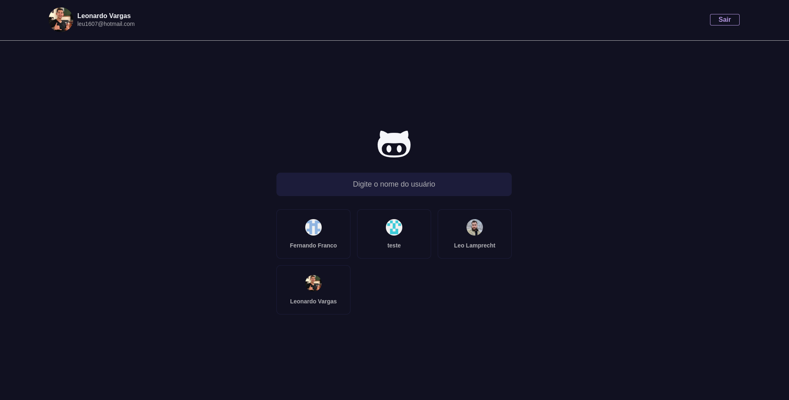

<h1 align="center">
  Github Explorer
</h1>



## Projeto

Esse projeto é uma ferramenta integrada com a api do github, podendo buscar um perfil e ver os repositórios do perfil buscado.

## Funcionalidades

- [x] Autenticação com `nextAuth`
- [x] Rotas dinâmicas com o `next params`
- [x] Salvando perfis no `localStorage`

## Como executar

Será necessário fazer o clone do projeto

```bash
$ git clone https://github.com/rasmoo-edtech/github-explorer 
```

Instalar as dependências e executar o script de inicialização


```bash
$ yarn

$ yarn next
```

